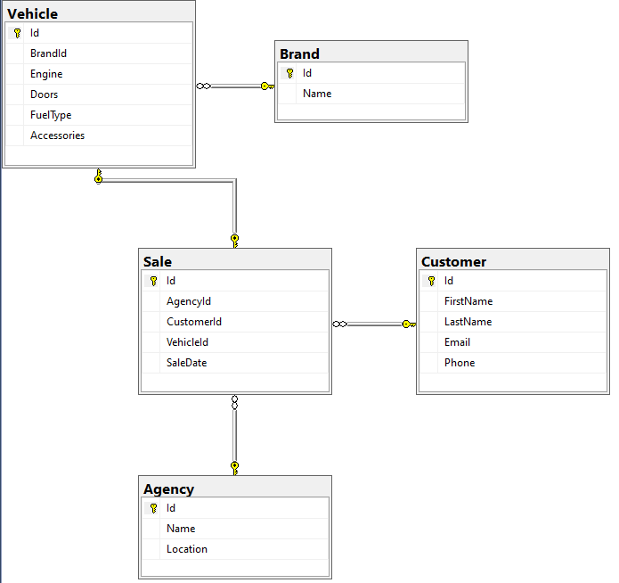

# ITM - Exámen #1 marzo 12 de 2025

							
Grupo: miercoles 6-8 am

La agencia de venta de vehículos "ITM" tiene una única sede ubicada en la ciudad de
Medellín. Requiere un sistema para grabar las ventas de los vehículos que ofrece, sólo
ofrece vehículos nuevos.
El sistema debe permitir grabar los vehículos con sus principales características: motor,
número de puertas, tipo de combustible y accesorios (Es un texto libre para ingresar las
características: Aire acondicionado, sensores de parqueo, etc).
El concesionario vende vehículos de diferentes marcas.
Para el modelo solo debe considerar la agencia, el cliente, la marca del vehículo,
el vehículo y la venta. Considere que un cliente sólo compra un vehículo a la vez, es decir,
puede comprar muchos vehículos en el tiempo, pero solo uno por "venta", y que como son 
vehículos nuevos, un vehículo sólo se vende a un cliente.
No considere un modelo con tablas de referencia que permitan homologar temas como el color,
el modelo, la referencia, entre otras. Sólo considere las entidades sugeridas: agencia, cliente,
vehículo, marca y venta.
Debe crear una base de datos en SQL Server con el diagrama de datos que tenga las relaciones
entre las tablas.
Elabore un servicio REST para Elaborar consultas (Al menos dos), el insert, update y delete
en la base de datos para el registro de los vehículos.
Implemente las pruebas de todos los servicios desde Postman y grabe la información de ellas.
El examen es en parejas.
El tiempo máximo para entregar el examen es el miércoles a las 11:59 am.
El código fuente se debe publica en github.
En teams (En la tarea), debe publicar una imagen con el diagrama de la base de datos donde se
vean las tablas y las relaciones.
Un video con el funcionamiento del sistema desde Postman. Video corto donde se vea la funcionalidad
y los resultados en la base de datos. Si el sistema no funciona, el video debe mostrar el alcance
de lo que se logra: Código fuente, bd, postman. (Video corto)
Un link de github para ver el código fuente.